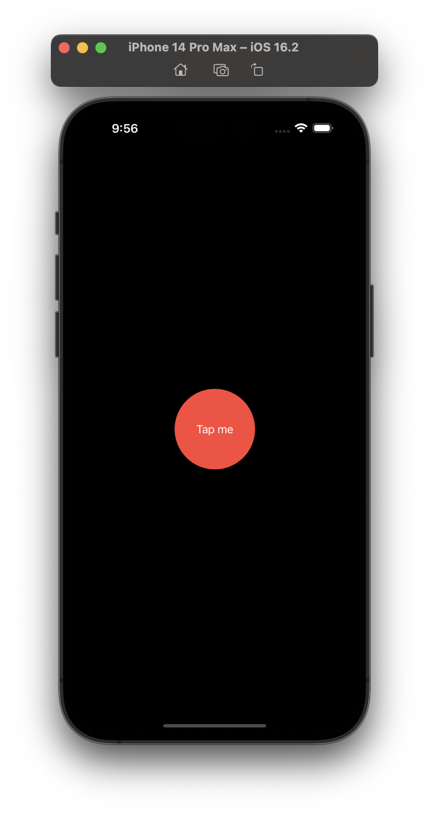

#  Animations in SwiftUI

## Implicit animation
---
* we tell our views ahead of time “if someone wants to animate you, here’s how you should respond”, and nothing more. 

* modifier that is used is **scaleToFill()**
    * it takes values greater than 0
    * value 1 is equivalent to 100% of its size

    * ```swift
        
            @State private var animationAmount = 1.0
    
            var body: some View {
                Button("Tap me"){
                    animationAmount+=1
                }
                .padding(50)
                .background(.red)
                .foregroundColor(.white)
                .clipShape(Circle())
                .scaleEffect(animationAmount)
                .blur(radius: (animationAmount - 1) * 3)
                .animation(.default, value: animationAmount)
            }
    
      ```
    * Screenshots1 | Screenshots2
        ------------ | ------------- 
         | 
