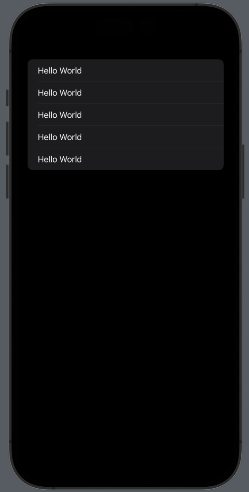
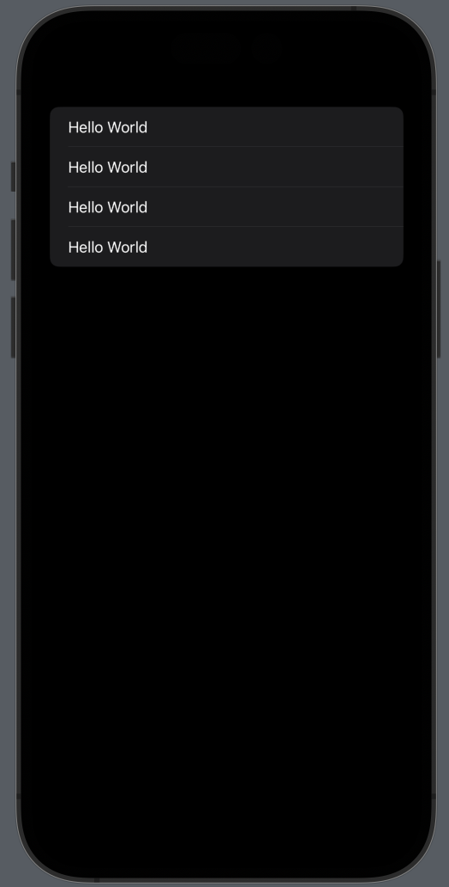
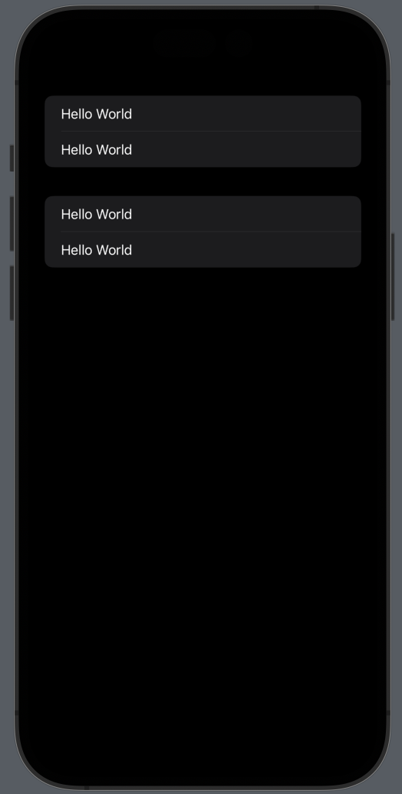

# Form View

* Forms are scrolling lists of static controls like text and images, but can also include user interactive controls like text fields, toggle switches, buttons, and more.

* You can create a basic form just by wrapping the default text view inside Form, like this:

```swift
    var body : some View{
        //simple Form view (child limit is 10)
        Form{
            Text("Hello World")
            Text("Hello World")
            Text("Hello World")
            Text("Hello World")
            Text("Hello World")
        }
    }
```


```swift
    var body : some View{
        //Form with Groups
        Form{
            Group{
                Text("Hello World")
                Text("Hello World")
            }
            Group{
                Text("Hello World")
                Text("Hello World")
            }
        }
        
    }
```


```swift
    var body : some View{
        //Form with Sections
        Form{
            
            Section{
                Text("Hello World")
                Text("Hello World")
            }
            Section{
                Text("Hello World")
                Text("Hello World")
            }
        }
        
    }
```





